Linuxserver - Installation
==========================

(Flash eventuelt en USB-nøgle med Linux-ISO'en med mindre I planlægger en VM)
Boot maskinen op på ISO'en og følg installationen herunder.

.. figure:: /graphic/1_Installationssprog.png
    :width: 200
    :alt: Alternative text
    :figclass: align-right

1. Vælg installationssprog - "Dansk"

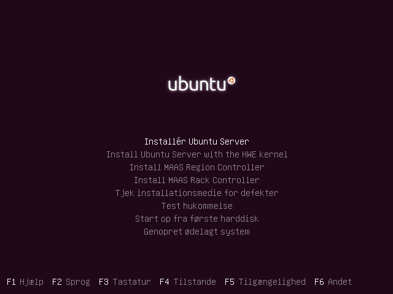

2. Vælg at insallere - "Installér Ubuntu Server"

.. figure:: graphic/3_Oversættelse.png
    :width: 200
    :alt: Alternative text
    :figclass: align-right

3. Bekræft at den manglende oversættelse af installationssproget ikke er komplet - "Ja"

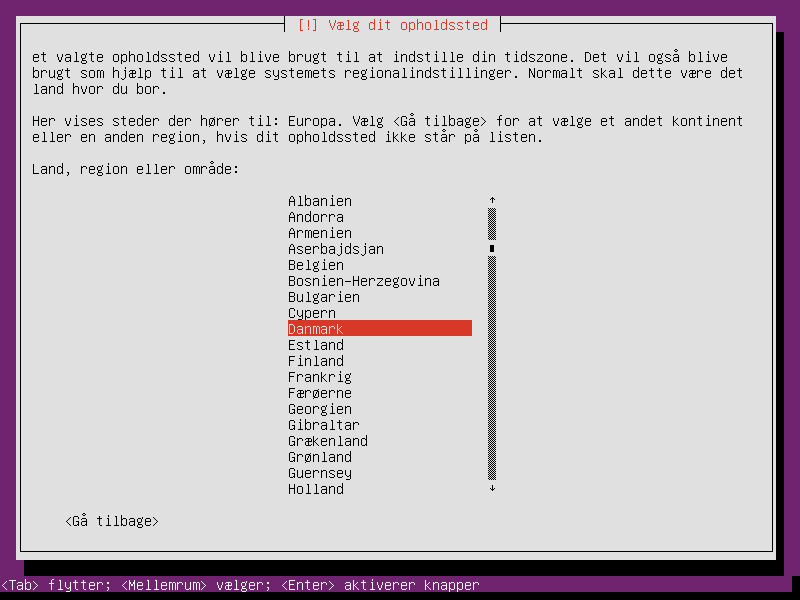

4. Vælg opholdssted - "Danmark"

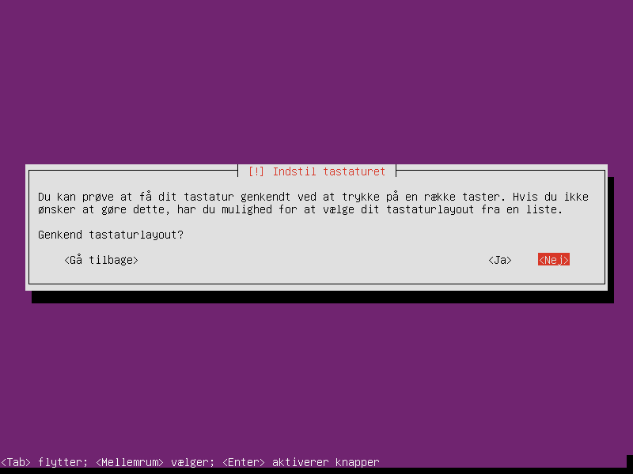

5. Genkend tastaturet - "Nej"

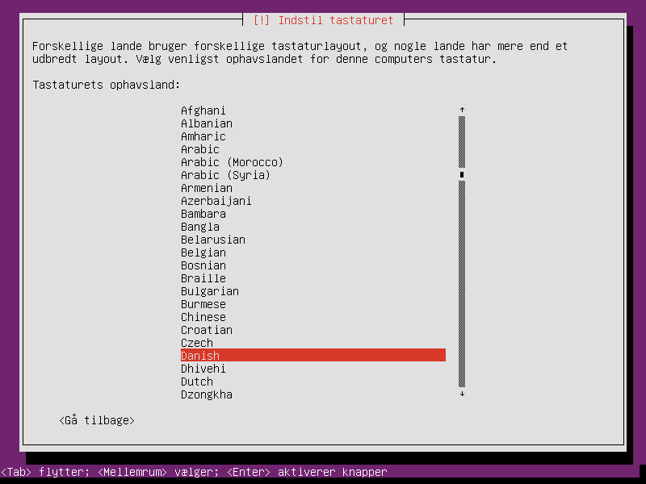

6. Indstil tastaturet - "Danish"

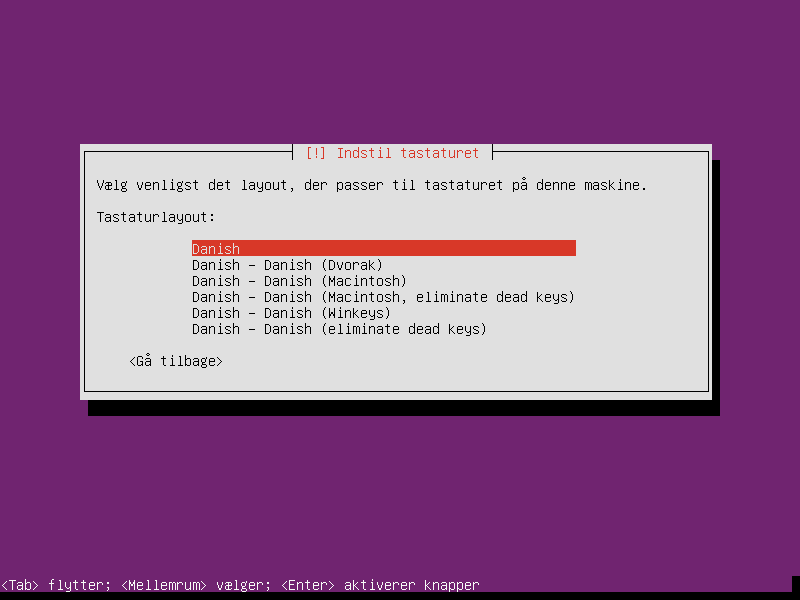

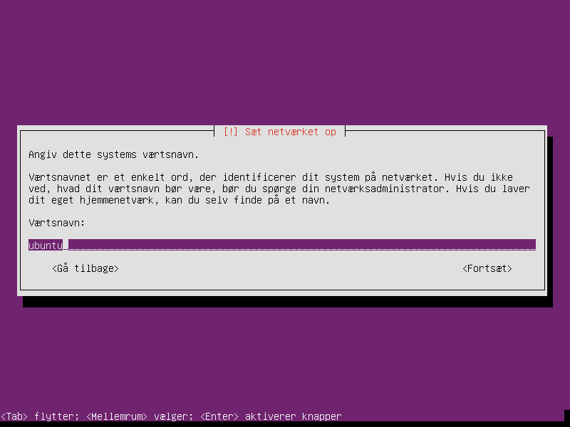

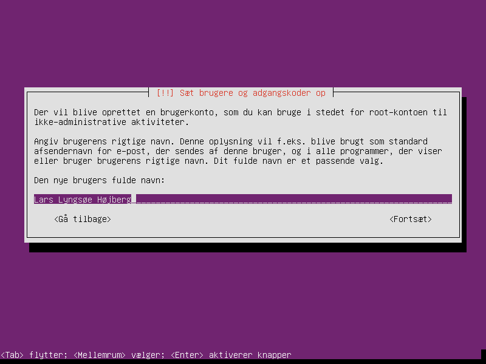

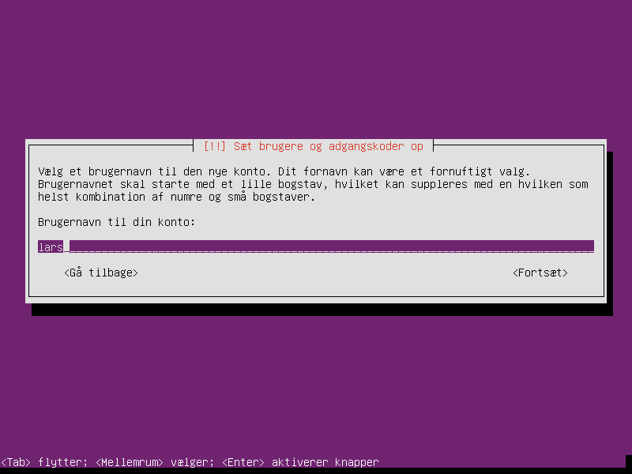

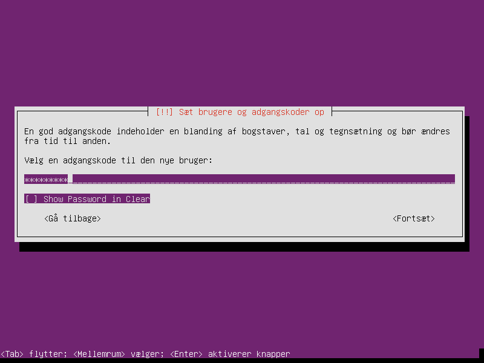

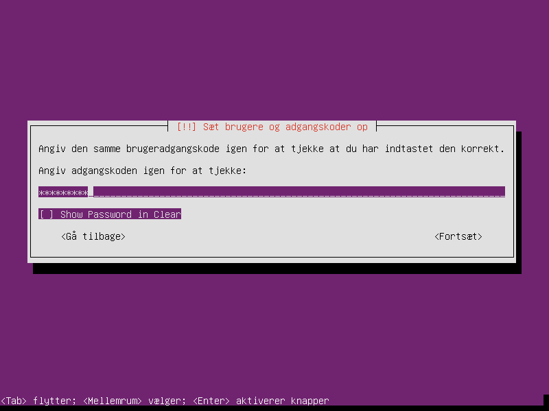

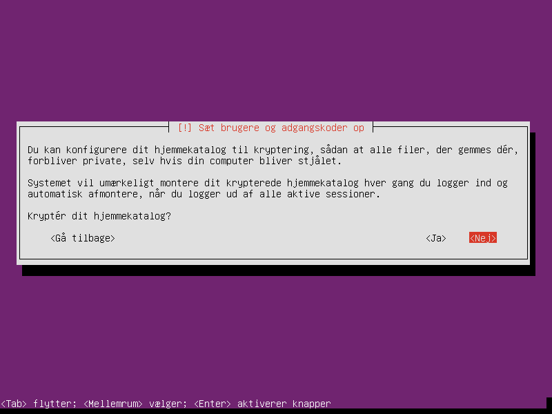

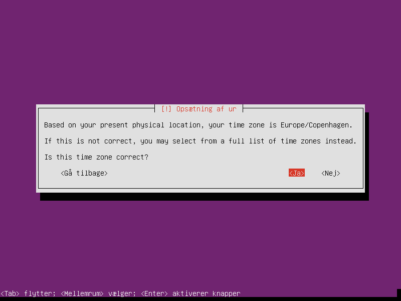

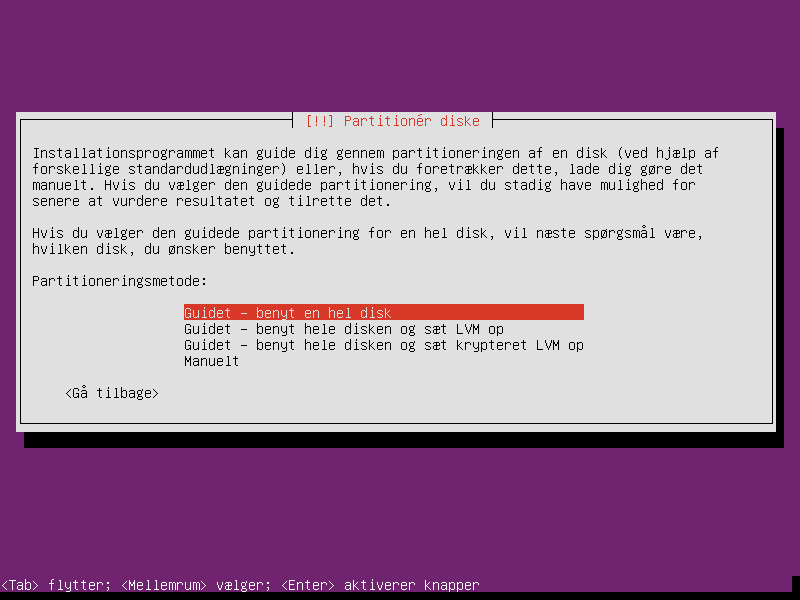

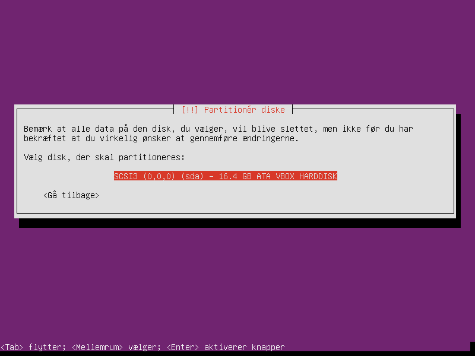

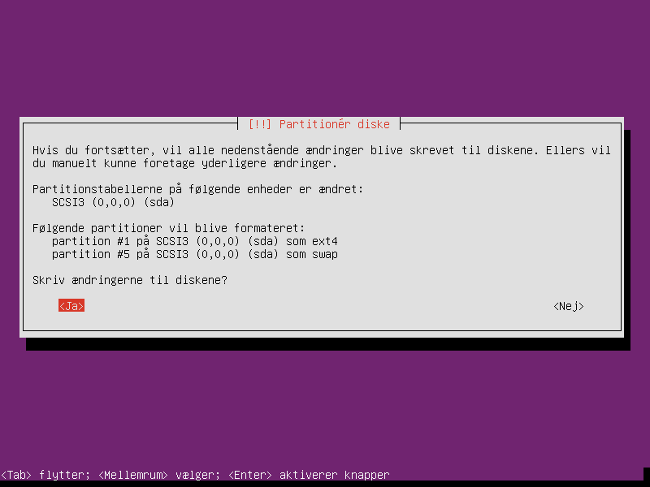

.. figure:: graphic/18_AutomatiskeOpdateringer.png
    :width: 200
    :alt: Alternative text
    :figclass: align-right

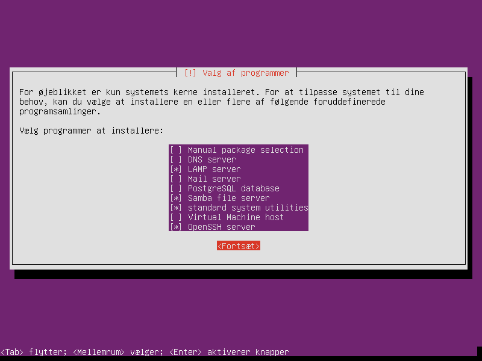

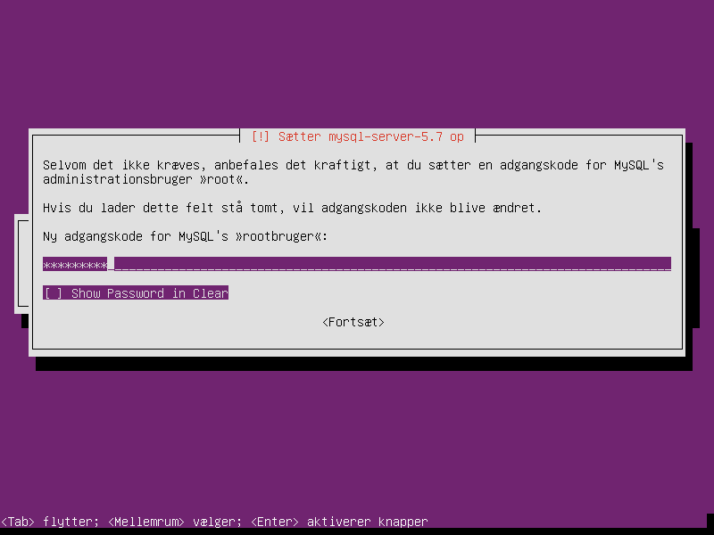

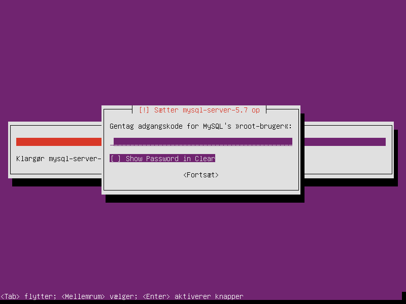

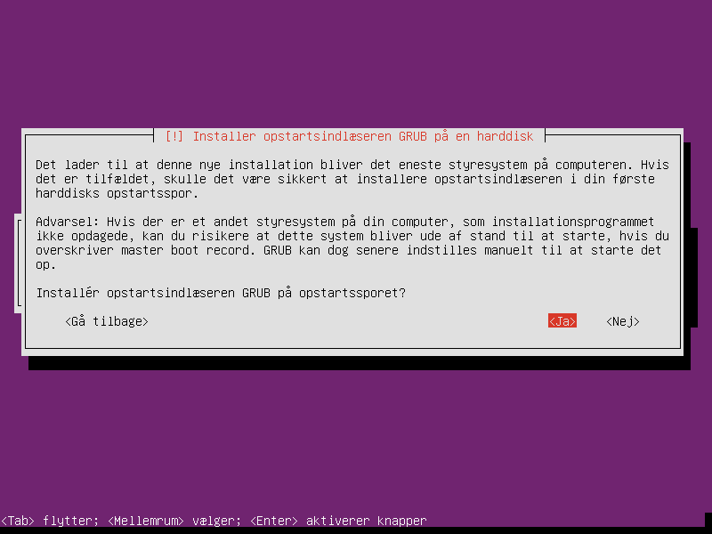

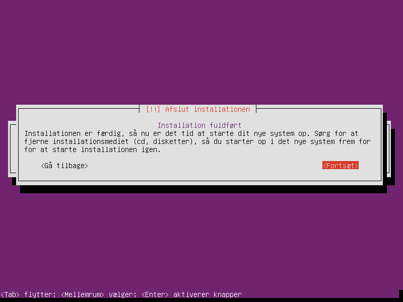

The end!
